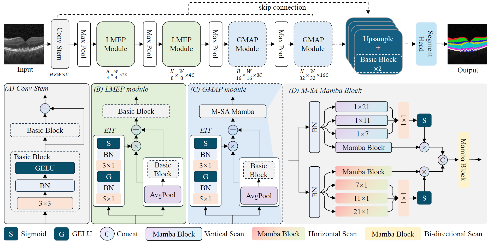

# MSAPNet: Multi-Scale and Multi-Axial Perception Network for Retinal Layers and Lesion Segmentation

## Introduction
> Optical coherence tomography (OCT) images are commonly used to assess the thickness of individual retinal layers and identify disease-related pathological alterations in layer boundaries. However, the OCT imaging quality often suffers from noise, artifacts, and distortions, which greatly challenge the automatic methods for achieving precise retinal layer and lesion segmentation. To address these challenges, we propose a novel method called MSAPNet, which consists of a local multi-scale edge perception (LMEP) module and a global multi-scale and multi-axial perception (GMAP) module with multi-scale and multi-axial mamba. The MSAPNet is capable of perceiving both local edge information and global information. Additionally, it can supplement the deficiency in spatial information perception of mamba by aggregating cross-axial information. The experimental results demonstrate the competitive performance of our proposed method in tasks involving retinal layer and lesion segmentation, achieving the best average Dice of 0.9191 and average IoU of 0.8636 compared to state-of-the-art segmentation models, highlighting its superiority.
 

# Preparation 
## Requirements
* Pytorch ==2.0.1
* Python ==3.8
* mamba-ssm == 1.0.1
* causal-conv1d ==1.0.0
* CUDA == 11.6+
